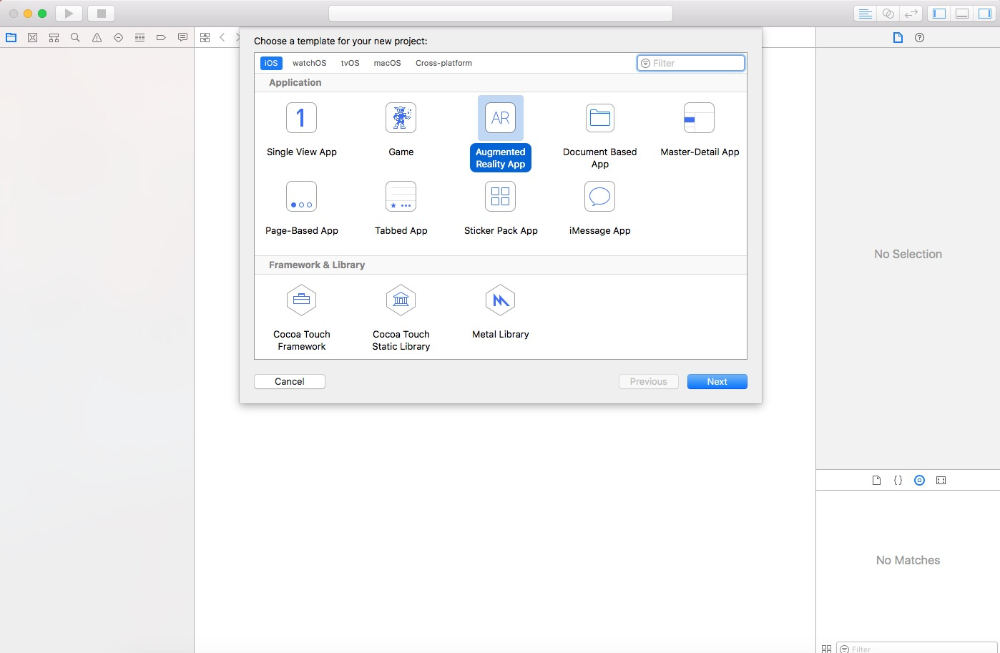

# 关于iOS-11新功能 ARKit的基本使用实践

ARKit主要有三层核心技术技术

- 第一层：快速稳定的世界定位 ，包括实时运算，运动定位，无需预设（软硬件）

- 第二层：平面和边界感知 碰撞测试和光线估算，让虚拟内容和现实环境无缝衔接。

- 第三层，渲染 支持各种渲染制作工具，目标就是简单易用，和其它插件融合度好。

如果只是想要单纯看一下效果，那么直接创建一个AR应用，然后在手机上运行即可



接着便可以直接看到效果了


AR效果如上图所示

关于纯代码构建的AR

- `SCNView`作为展示效果的背景放置在控制器中
- `SCNScene`拿到工程里面放置3D建模文件的地址， 构建精灵角色，并放置到背景版`SCNView`中
- `ARSessionConfiguration`在配置类对象里设置会话如何将真实的设备运动映射到3D场景的坐标系统里，世界坐标

创建一个`SCNView`对象，给它一个`SCNScene`精灵角色，将它放置在窗口中，加载会话配置`ARSessionConfiguration`就构建了一个简单的AR效果。
以下是最简易构建AR的过程
```objective-c
    /// 精灵图像
    private let scene:SCNScene = SCNScene.init(named: "art.scnassets/ship.scn")!
    
    /// 背景
    private lazy var scnView:ARSCNView = {
        let scnView = ARSCNView.init(frame: UIScreen.main.bounds)
        scnView.delegate = self
        scnView.scene = self.scene
        self.view.addSubview(scnView)
        return scnView
    }()
    
    override func viewWillAppear(_ animated: Bool) {
        super.viewWillAppear(animated)
        self.scnView.session.run(ARWorldTrackingSessionConfiguration.init())
    }
    
    override func viewWillDisappear(_ animated: Bool) {
        super.viewWillDisappear(animated)
        self.scnView.session.pause()
    }
    
    override var prefersStatusBarHidden: Bool{
        return true
    }
```
